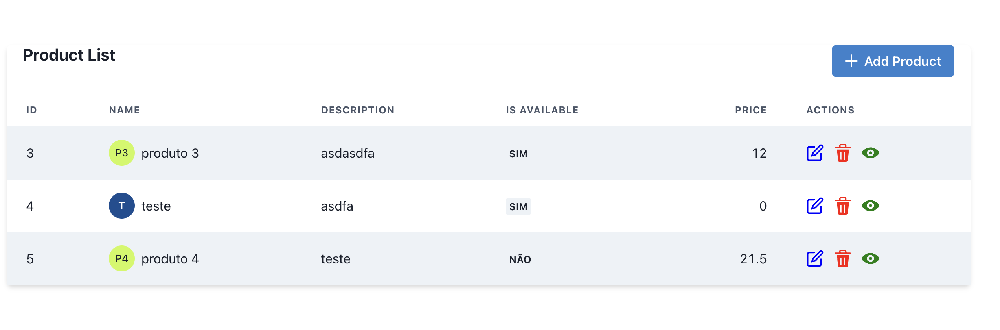
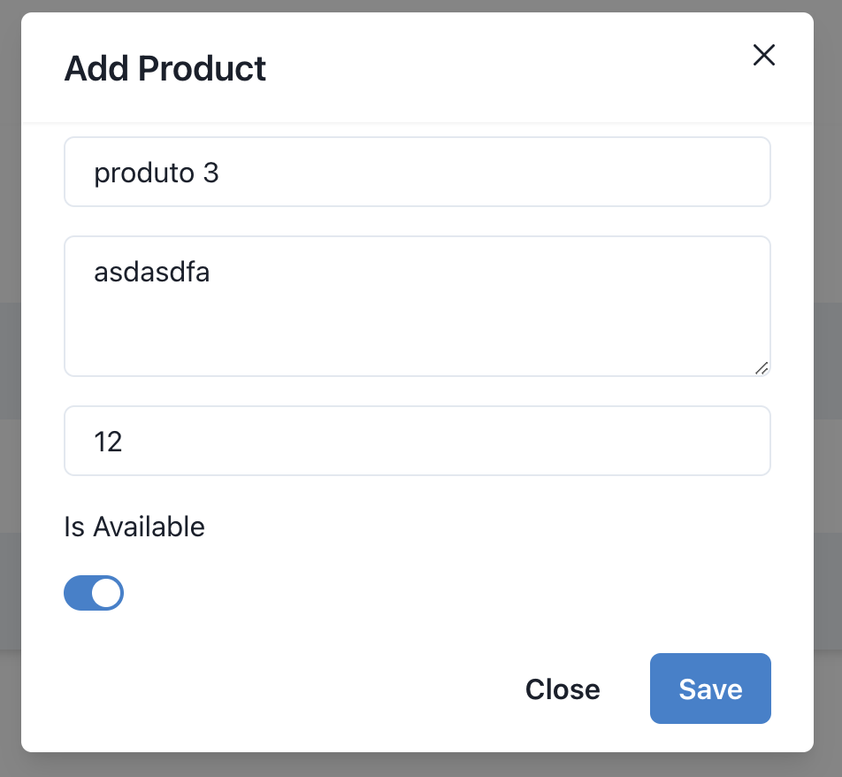

# Produtos

Este é um projeto fullstack utilizando .Net8 e reactJS 18, com objetivo de salvar produtos com interface atraente no frontend
e salvar esses produtos no backend com banco sqlServer

## Ambiente de Desenvolvimento

Para execucão do projeto local:

1. Ter o Node.js e sqlserver para o banco de dados ou uma imagem do sqlserver no docker instalados em seu ambiente
2. Clone este repositório em sua máquina local.
3. No diretório raiz do projeto, execute o seguinte comando para instalar as dependências:

```bash
npm install
```

4. Após a instalação das dependências, você pode iniciar o servidor de desenvolvimento com o seguinte comando:

dentro da pasta frontend

```bash
npm run dev
```

dentro da pasta backend

```bash
dotnet run watch
```

5. O App estará disponível em `http://localhost:4200/` por padrão. URL acessável em qualquer navegador, mais o recomendado é o Google Chrome.

## Funcionalidades

1. **Tela Listagem Produtos**: Primeira tela ao iniciar a aplicação



2. **Tela Adicionar Produto**: Tela de cadastro de produto


3. **Tela Edição Produto**: Tela de edição de cadastro do produto



4. **Tela Delete Produto**: Tela de deleção do produto


5. **Tela Detalhes Produto**: Tela de detalhes do produto


## Dependências Externas

Este projeto utiliza as seguintes dependências externas:

- **React 17**: Biblioteca Typescript para construção de aplicações web.
- **.Net8.0**: Framework para construção de aplicacao fullstack.
